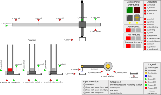

# Model-Based Systems Engineering: Distributing and Handling Station

CIF models and a supervisory controller for a distributing and handling station, built for
the TU/e Model-Based Systems Engineering course (4TC00). The station takes products from
three stacks, picks them up with a crane arm and a rotating transfer lever, and delivers
them to a testing station. The work models the machine, designs a controller for it,
simulates the two together against a digital twin, and generates PLC code from the same
controller model.

The models are written in CIF, the modeling language of the Eclipse ESCET toolset for
supervisory controller design. The controller was developed alongside a plant model of the
hardware, so the same controller can be checked in simulation and then translated to PLCopen
XML for a programmable logic controller without rewriting it.

The figure is the SVG digital twin used during simulation. It shows the crane arm on its
rail with position sensors, the three product stacks with their pushers, the rotating
transfer lever with a vacuum gripper, the distributing-station control panel with start,
stop, reset and auto or manual switch, and the actuator and sensor legend. Sensor and
actuator states in the SVG are driven directly by the running CIF model.

## What the models do

- Plant model. The physical station: three product stacks with pushers, a crane arm that
  moves along a rail and grips products, and a rotating transfer lever with a vacuum
  gripper. Products come in different colours and each stack holds up to five. The plant
  is coupled to the SVG so a simulation animates the real hardware layout.
- Controller. The supervisory controller alternates between the stacks to pair
  complementary products (for example lids from one stack with jars from the other two
  following a 1-3-2-3 order), places a product in the testing station only when it is ready
  in automatic mode, lets the current transfer cycle finish before applying a change of the
  auto or manual key, and recovers when a product is lost from the gripper by fetching a
  replacement from the same stack set. It drives only the actuators that are needed.
- Use cases. Automated scenarios exercised in simulation: alternating product delivery,
  simultaneous operation across all three stacks, and error recovery when a product is lost
  during transfer.
- PLC generation. The controller merged with a hardware mapping is translated to PLCopen
  XML, so the synthesized logic can run on an actual PLC.

## Contents

| File | Role |
| --- | --- |
| `plant.cif` | Main plant model. Defines products, the crane arm and transfer-lever geometry and speeds, the button and use-case events, and imports the I/O, SVG and use-case files. |
| `plant-io.cif` | Input and output mapping for the plant: sensor and actuator variables. |
| `plant-svg.cif` | Couples the plant model to `plant.svg` so simulation animates the visualization. |
| `plant-usecases.cif` | Automated use cases that mimic operator input for the scenarios above. |
| `manual.cif` | Manual-mode plant model, used to drive the actuators by hand and understand the machine before adding the controller. |
| `ctrl.cif` | The controller model: startup logic, per-stack pusher control, product pairing and error recovery. |
| `ctrl-io.cif` | Input and output mapping for the controller. |
| `plant.svg` | Digital-twin visualization of the station (shown above). |
| `lib/hw.cif` | Hardware mapping used when generating PLC code. Library file, not modified. |
| `lib/ctrl-test.cif` | Controller test model. Library file, not modified. |
| `1-manual-plant-first.tooldef`, `1-manual-plant-last.tooldef` | Simulate the manual plant model, taking the first or the last of the possible transitions. |
| `2-ctrl-plant-first.tooldef`, `2-ctrl-plant-last.tooldef` | Merge controller and plant and simulate them together with the SVG visualization. |
| `3-plc-gen.tooldef`, `3-plc-gen-test.tooldef` | Merge the controller with the hardware mapping and generate PLCopen XML. |
| `mid_report_group_114_2024.pdf` | Midterm report: the manual-mode plant model and the plant-plus-controller simulation. |
| `final_report_group_114_2024.pdf` | Final report: control strategy, assumptions, use cases and operator instructions. |

## Running the models

The models run in the Eclipse ESCET toolset for CIF. The `.tooldef` scripts drive the
standard CIF tools: `cifmerge` to combine the controller and plant, `cifsim` to simulate
the merged model with the SVG visualization, and `cif2plc` to generate PLCopen XML. Open
the project in ESCET and execute a `.tooldef` script to run its stage:

- `1-manual-plant-*.tooldef`: simulate the plant on its own in manual mode.
- `2-ctrl-plant-*.tooldef`: simulate the controller together with the plant and watch the
  station animate in the SVG.
- `3-plc-gen*.tooldef`: generate PLC code from the controller and the hardware mapping.

To operate the station in simulation, fill the stacks using the buttons in the
visualization, press the green start button on the distributing panel, and use the red stop
button to halt. The LEDs show actuator and sensor states in real time.

## Technologies

- CIF, the modeling language of the Eclipse ESCET toolset
- Supervisory controller design and simulation with a coupled SVG digital twin
- PLC code generation to PLCopen XML

## Authors

Group 114: Kirill Naval, Valentin Nikushor, Daniel Tyukov.
